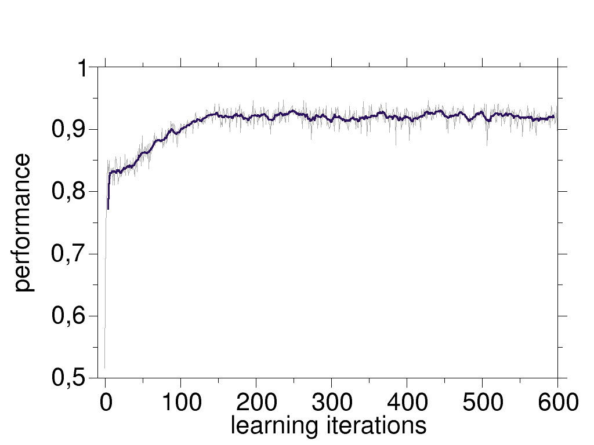

# secretary-problem-RL-DDQN

## Problem

Here we address the secretary problem [[1]](https://en.wikipedia.org/wiki/Secretary_problem) for which we have implemented an environment [here](https://github.com/nima-siboni/secretary-problem-env/). 

The agent should figure out the optimal policy which maximizes the average outcome of the recruting process. The best possible outcome of the process is equal to 1, as the applicants have random scores in range [0, 1]. One should note that, in the ```N``` candidates which are interviewed in each process, the maximum of that realization is not necessarily equal to 1.


## Solution

### RL-Approach
Here we have implemented the DDQN approach with a network of 2-layers. Our results show that, for an environment with ```N=20``` candidatres, the agent can increase its performance up to ```0.95```, where the performance is equal to the average scores of the accepted candidates. 



This is a remarkable achievement, as the performance of the *1/e-law best choice* is almost ```0.8``` (for ```N=20```; one can check that with Monte-Carlo simulations using the env). The reason that our agent can do better than the 1/e-law (which is the optimal policy for the secretary problem), could be traced back to the fact that in the secretary problem the secretary does not know anything about the candidates out there. In contrary, our agent had the opportunity to experience the candidate's distibution, together with experimenting the stopping step.

## Requirements

```
gym==0.17.2
keras
numpy
random2
tensorflow==2.2.0
tqdm
```

All the requirements are included ```requirements.txt``` file.

## Usage

After cloning the repository, run 

``` python experience-and-learn.py```

This script creates the agent, and the episodes from which it should learn. The performance of the agent during the learning process is tracked in ```performance-and-animations/steps_vs_iterations.dat``` in format of two columns: (i) id of the learning episode, and (ii) average performance after that episode.
